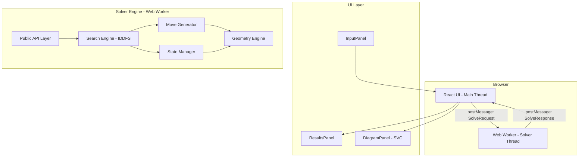
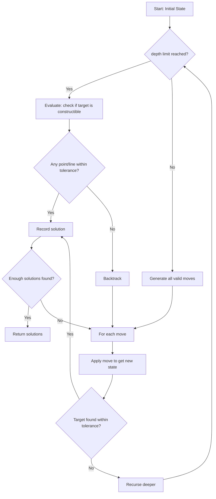
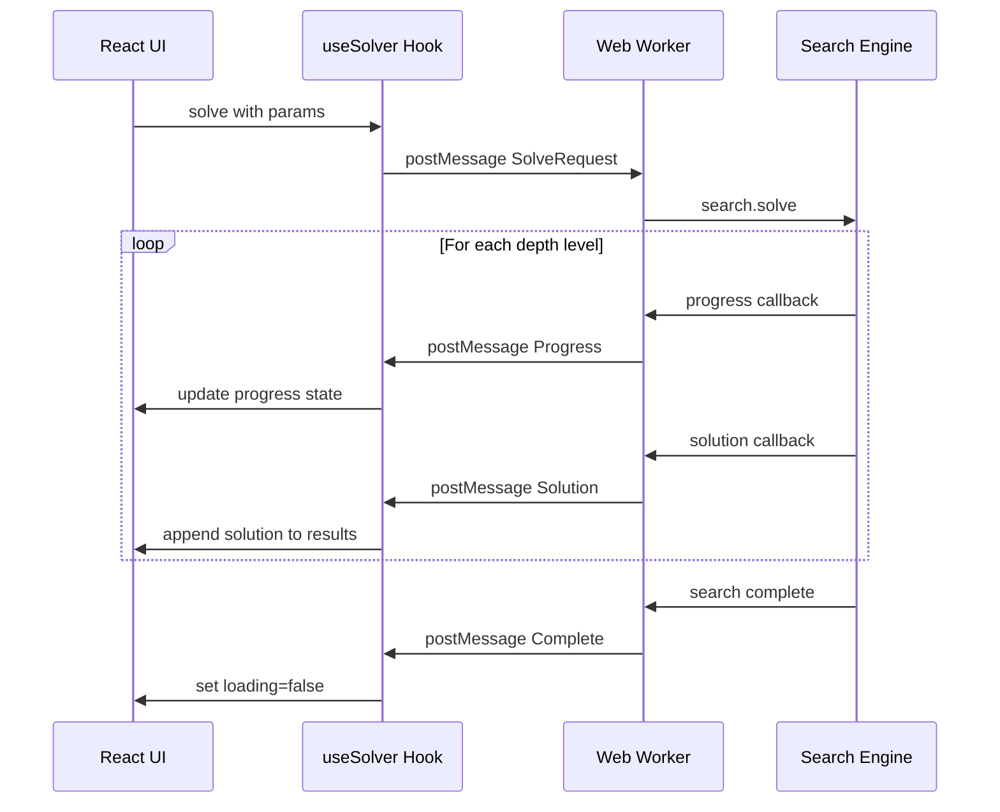
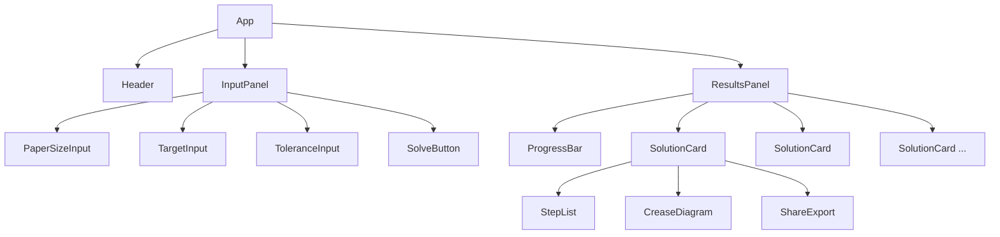

# Origami Reference Finder — Architecture & Implementation Plan

## 1. Project Overview

A browser-based origami reference finder that generates minimal fold sequences to locate target references (points or lines) on a rectangular sheet of paper. Pure client-side, deployable to GitHub Pages.

**Tech Stack:**
- **Build tool:** Vite
- **UI:** React 18 + TypeScript
- **Solver:** TypeScript, running in a Web Worker
- **Diagrams:** SVG (inline React components)
- **Testing:** Vitest for unit tests
- **Styling:** Tailwind CSS v4

---

## 2. High-Level Architecture



---

## 3. Project Structure

```
ReferenceFinder/
├── index.html
├── package.json
├── tsconfig.json
├── vite.config.ts
├── vitest.config.ts
├── public/
│   └── favicon.svg
├── src/
│   ├── main.tsx                    # React entry point
│   ├── App.tsx                     # Root component
│   │
│   ├── components/                 # React UI components
│   │   ├── InputPanel.tsx          # Paper size, target, tolerance inputs
│   │   ├── ResultsPanel.tsx        # Ranked solution list
│   │   ├── SolutionCard.tsx        # Single solution display
│   │   ├── StepList.tsx            # Step-by-step fold instructions
│   │   ├── CreaseDiagram.tsx       # SVG crease diagram
│   │   ├── ShareExport.tsx         # Copy/share/JSON export
│   │   └── Header.tsx              # App header
│   │
│   ├── solver/                     # Core solver engine
│   │   ├── geometry.ts             # Points, lines, intersections, transforms
│   │   ├── state.ts                # FoldState: tracks creases, points, lines
│   │   ├── moves.ts                # Move generation (fold vocabulary)
│   │   ├── search.ts               # IDDFS search engine
│   │   ├── scoring.ts              # Solution scoring and ranking
│   │   ├── descriptions.ts         # Human-readable fold descriptions
│   │   ├── api.ts                  # Public API: solvePoint, solveLineX, solveLineY
│   │   └── types.ts                # Shared type definitions
│   │
│   ├── worker/                     # Web Worker bridge
│   │   ├── solver.worker.ts        # Worker entry point
│   │   └── workerClient.ts         # Main-thread client for worker
│   │
│   ├── hooks/                      # React hooks
│   │   └── useSolver.ts            # Hook wrapping worker communication
│   │
│   └── utils/                      # Shared utilities
│       ├── math.ts                 # Numeric helpers, epsilon comparisons
│       └── format.ts               # Number formatting, coordinate display
│
├── tests/
│   ├── geometry.test.ts
│   ├── moves.test.ts
│   ├── search.test.ts
│   ├── api.test.ts
│   └── scoring.test.ts
│
└── plans/
    └── architecture.md             # This file
```

---

## 4. Geometry Engine (`solver/geometry.ts`)

### 4.1 Core Types

```typescript
/** A 2D point with exact rational-like representation */
interface Point {
  x: number;
  y: number;
}

/** A line in general form: ax + by + c = 0, normalized so a²+b²=1 */
interface Line {
  a: number;
  b: number;
  c: number;
}

/** A line segment (bounded portion of a line) */
interface Segment {
  p1: Point;
  p2: Point;
  line: Line;  // the underlying infinite line
}
```

### 4.2 Key Operations

| Operation | Description |
|-----------|-------------|
| `lineFromPoints(p1, p2)` | Create normalized line through two points |
| `lineFromSegment(seg)` | Extract line from segment |
| `intersectLines(l1, l2)` | Find intersection point (or null if parallel) |
| `reflectPointOverLine(p, l)` | Reflect a point over a line (fold operation) |
| `perpendicularBisector(p1, p2)` | Line equidistant from two points |
| `distancePointToLine(p, l)` | Signed distance from point to line |
| `distancePointToPoint(p1, p2)` | Euclidean distance |
| `pointOnPaper(p, w, h)` | Check if point is within paper bounds |
| `clipLineToPaper(l, w, h)` | Clip infinite line to paper rectangle, return segment |
| `linesAreEqual(l1, l2, eps)` | Check if two lines are the same within tolerance |
| `pointsAreEqual(p1, p2, eps)` | Check if two points are the same within tolerance |

### 4.3 Numeric Precision

- Use `number` (float64) throughout — sufficient for 6-fold depth
- Define `EPSILON = 1e-10` for geometric comparisons
- Normalize all lines to `a² + b² = 1` with canonical sign convention (a > 0, or a=0 and b > 0)
- Snap coordinates within epsilon to avoid duplicate states

---

## 5. Fold State (`solver/state.ts`)

### 5.1 FoldState

```typescript
interface FoldState {
  /** Paper dimensions */
  width: number;
  height: number;

  /** All known points (corners + intersections of creases with paper edges + crease-crease intersections) */
  points: Point[];

  /** All known lines/creases (paper edges + fold creases) */
  lines: Line[];

  /** All known segments (creases clipped to paper) */
  segments: Segment[];

  /** History of folds applied to reach this state */
  foldHistory: Fold[];
}

interface Fold {
  type: FoldType;
  /** The crease line produced by this fold */
  creaseLine: Line;
  /** Human-readable description */
  description: string;
  /** References used (which points/lines were aligned) */
  ref1: FoldReference;
  ref2: FoldReference;
}

type FoldType =
  | 'edge-to-edge'
  | 'corner-to-corner'
  | 'corner-to-edge'
  | 'corner-to-crease'
  | 'edge-to-crease'
  | 'crease-to-crease'
  | 'point-to-point'
  | 'point-to-line';

interface FoldReference {
  kind: 'point' | 'line';
  /** Index into state.points or state.lines */
  index: number;
  /** Human label like "top-left corner", "center crease", etc. */
  label: string;
}
```

### 5.2 Initial State

For a paper of width `w` and height `h`:

**Points (4 corners):**
- `(0, 0)` — bottom-left
- `(w, 0)` — bottom-right
- `(w, h)` — top-right
- `(0, h)` — top-left

**Lines (4 edges):**
- Bottom edge: `y = 0`
- Right edge: `x = w`
- Top edge: `y = h`
- Left edge: `x = 0`

**Segments (4 edge segments):**
- Corresponding segments for each edge

### 5.3 State Transitions

When a fold is applied:
1. Compute the new crease line
2. Clip crease to paper → new segment
3. Find intersections of new crease with all existing segments → new points
4. Find intersections of new crease with paper edges → new points
5. Deduplicate points and lines (within epsilon)
6. Add fold to history

---

## 6. Move Generator (`solver/moves.ts`)

### 6.1 Fold Vocabulary

The move generator produces all valid folds from a given state. Each fold creates a crease line.

#### Move Type 1: Point-to-Point Folds (Perpendicular Bisector)
- For each pair of distinct points `(p_i, p_j)`:
  - Crease = perpendicular bisector of `p_i` and `p_j`
  - Only if crease intersects the paper
- This covers: edge-to-edge (midpoints), corner-to-corner, corner-to-crease-intersection, etc.

#### Move Type 2: Point-to-Line Folds (Huzita Axiom 5 / Axiom 2 variant)
- For each point `p` and line `l`:
  - If `p` is not on `l`: fold `p` onto `l`
  - This produces up to 2 crease lines (tangent lines from point to parabola)
  - Crease passes through the midpoint of `p` and its reflection, perpendicular to the line connecting them
  - **Simplification:** For the initial implementation, we can represent this as: for each point `p` and each point `q` on line `l` (specifically, the foot of perpendicular from `p` to `l`, and intersections of `l` with other creases), compute perpendicular bisector of `p` and `q`.

#### Move Type 3: Line-to-Line Folds (Bisector of two lines)
- For each pair of non-parallel lines `(l_i, l_j)`:
  - Two angle bisectors exist
  - Both are valid creases
- For each pair of parallel lines `(l_i, l_j)`:
  - One crease: the line equidistant between them

### 6.2 Pruning in Move Generation

To keep the branching factor manageable:

1. **Deduplication:** Skip moves that produce a crease already in the state
2. **Paper bounds:** Skip creases that don't intersect the paper rectangle
3. **Symmetry:** Canonical ordering of point/line pairs to avoid generating (A,B) and (B,A)
4. **Relevance pruning (optional, depth > 3):** Prefer moves that create creases/points closer to the target
5. **Move count limits:** Cap the number of moves per depth level if needed

### 6.3 Estimated Branching Factor

| Depth | Approx Points | Approx Lines | Point-Point Moves | Line-Line Moves | Total Moves |
|-------|--------------|-------------|-------------------|----------------|-------------|
| 0     | 4            | 4           | 6                 | 10             | ~16         |
| 1     | ~8           | 5           | ~28               | ~14            | ~42         |
| 2     | ~15          | 6           | ~105              | ~19            | ~124        |
| 3     | ~25          | 8           | ~300              | ~36            | ~336        |

With aggressive pruning (dedup, bounds, relevance), effective branching factor should be ~15-30.

---

## 7. Search Engine (`solver/search.ts`)

### 7.1 Algorithm: Iterative Deepening Depth-First Search (IDDFS)



### 7.2 Search Strategy

1. **Iterative deepening:** Search depth 1, then 2, ..., up to max depth 6 (optional 7)
2. **Early termination:** At each state, check if any constructible point/line satisfies the target within tolerance
3. **Solution collection:** Collect up to N solutions (e.g., 10) at the minimum depth, then optionally continue to depth+1 for alternatives
4. **State hashing:** Hash each state's set of lines (sorted, snapped) to detect and skip duplicate states
5. **Progressive results:** Send partial results back to UI as solutions are found

### 7.3 Target Evaluation

```typescript
function evaluateTarget(state: FoldState, target: Target, tolerance: number): Match | null {
  if (target.type === 'point') {
    // Check all constructible points
    for (const p of state.points) {
      const dx = Math.abs(p.x - target.x);
      const dy = Math.abs(p.y - target.y);
      if (dx <= tolerance && dy <= tolerance) {
        return { point: p, error: Math.hypot(dx, dy) };
      }
    }
  } else if (target.type === 'lineX') {
    // Check all vertical-ish lines for x = target.x
    for (const line of state.lines) {
      // Check if line is vertical at x ≈ target.x
      // Also check intersection points on that line
    }
    // Check all points for x ≈ target.x (any point defines a vertical reference)
    for (const p of state.points) {
      if (Math.abs(p.x - target.x) <= tolerance) {
        return { point: p, error: Math.abs(p.x - target.x) };
      }
    }
  }
  // Similar for lineY
}
```

### 7.4 Pruning Strategies

1. **Duplicate state detection:** Hash the set of crease lines; skip states already visited at same or lower depth
2. **Dominance pruning:** If state A has a superset of state B's creases at same depth, prune B
3. **Distance-based pruning (heuristic):** At depth d, if the closest constructible point/line is farther than what's achievable in (maxDepth - d) remaining folds, prune
4. **Symmetry breaking:** For square paper, exploit 8-fold symmetry (4 rotations × 2 reflections). For rectangular paper, exploit 4-fold symmetry (2 rotations × 2 reflections)

---

## 8. Scoring & Ranking (`solver/scoring.ts`)

Solutions are ranked by:

1. **Fold count** (primary, ascending)
2. **Error magnitude** (secondary, ascending — closer to target is better)
3. **Robustness score** (tertiary) — penalize folds where small alignment errors cause large position errors
4. **Simplicity score** — prefer common fold types (edge-to-edge > corner-to-corner > point-to-line)

```typescript
interface Solution {
  folds: Fold[];
  foldCount: number;
  achievedPoint?: Point;      // for point targets
  achievedLine?: Line;        // for line targets
  error: number;              // distance from target
  robustnessScore: number;    // higher is better
  simplicityScore: number;    // higher is better
  rank: number;               // computed ranking
}
```

---

## 9. Human-Readable Descriptions (`solver/descriptions.ts`)

Each fold gets a natural-language description based on its type and references:

| Fold Type | Example Description |
|-----------|-------------------|
| Edge-to-edge | "Fold the left edge to the right edge to create a vertical center crease" |
| Corner-to-corner | "Fold the bottom-left corner to the top-right corner to create a diagonal crease" |
| Point-to-point | "Fold point A to point B to create a crease at their midpoint" |
| Point-to-line | "Fold the top-left corner onto the bottom edge to create an angled crease" |
| Line-to-line | "Fold the left edge onto the diagonal crease to bisect the angle" |

**Labeling system:**
- Corners: "bottom-left", "bottom-right", "top-right", "top-left"
- Edges: "left edge", "right edge", "top edge", "bottom edge"
- Creases: "crease #1", "crease #2", or descriptive names like "center vertical crease", "diagonal crease"
- Points: Named by how they were constructed, e.g., "intersection of crease #1 and bottom edge"

---

## 10. Web Worker Protocol (`worker/`)

### 10.1 Message Types

```typescript
// Main thread → Worker
type WorkerRequest =
  | { type: 'solve'; id: string; params: SolveParams }
  | { type: 'cancel'; id: string };

interface SolveParams {
  width: number;
  height: number;
  target: Target;
  tolerance: number;
  maxDepth: number;        // default 6
  maxSolutions: number;    // default 10
}

type Target =
  | { type: 'point'; x: number; y: number }
  | { type: 'lineX'; x: number }
  | { type: 'lineY'; y: number };

// Worker → Main thread
type WorkerResponse =
  | { type: 'progress'; id: string; depth: number; solutionsFound: number }
  | { type: 'solution'; id: string; solution: Solution }
  | { type: 'complete'; id: string; solutions: Solution[] }
  | { type: 'error'; id: string; message: string };
```

### 10.2 Communication Flow



---

## 11. React UI Components

### 11.1 Component Tree



### 11.2 Component Specifications

#### `InputPanel`
- Paper width/height inputs (number, default 1×1 for square)
- Target mode selector: "Point" | "Vertical Line" | "Horizontal Line"
- X coordinate input (normalized 0-1) with "don't care" toggle
- Y coordinate input (normalized 0-1) with "don't care" toggle
- Tolerance input (percentage, default 0.5%)
- Max folds selector (dropdown: 4, 5, 6, 7)
- "Find References" button

#### `ResultsPanel`
- Shows progress bar during search (current depth, solutions found)
- Lists solutions as expandable cards, sorted by rank
- Empty state message when no search has been run

#### `SolutionCard`
- Collapsed: fold count, error, brief summary
- Expanded: full step list + crease diagram + share/export buttons

#### `CreaseDiagram` (SVG)
- Renders paper rectangle with proper aspect ratio
- Shows all creases from the solution (numbered, color-coded by fold order)
- Highlights the target point/line (red marker or dashed line)
- Shows the achieved point/line (green marker)
- Labels key points (corners, intersections)
- Responsive sizing

#### `ShareExport`
- "Copy Steps" button (plain text to clipboard)
- "Export JSON" button (downloads solution as JSON)

### 11.3 State Management

Use React `useState` + `useReducer` for local state. No need for global state management (Redux, Zustand) given the app's simplicity. All styling uses **Tailwind CSS v4** utility classes directly in JSX — no separate CSS files needed for components.

```typescript
interface AppState {
  // Input state
  paperWidth: number;
  paperHeight: number;
  targetMode: 'point' | 'lineX' | 'lineY';
  targetX: number;
  targetY: number;
  tolerance: number;
  maxDepth: number;

  // Solver state
  isSearching: boolean;
  searchProgress: { depth: number; solutionsFound: number } | null;
  solutions: Solution[];
  selectedSolutionIndex: number | null;
}
```

---

## 12. SVG Crease Diagram Design

### 12.1 Rendering Approach

```typescript
interface DiagramProps {
  width: number;           // paper width
  height: number;          // paper height
  folds: Fold[];           // fold sequence
  targetPoint?: Point;     // target point (if point mode)
  targetLine?: Line;       // target line (if line mode)
  achievedPoint?: Point;   // achieved reference point
  achievedLine?: Line;     // achieved reference line
  svgWidth?: number;       // SVG viewport width (default 400)
}
```

### 12.2 Visual Elements

| Element | Style |
|---------|-------|
| Paper outline | Black stroke, 2px, white fill |
| Paper edges | Labeled (L, R, T, B) |
| Crease lines | Colored by fold order (blue→green→orange→purple...), dashed |
| Crease labels | Small numbered circles at midpoint of each crease |
| Target point | Red circle, 6px radius |
| Target line | Red dashed line, full width/height |
| Achieved point | Green circle, 5px radius |
| Achieved line | Green solid line |
| Corner labels | Small text at corners |
| Intersection points | Small dots (3px) at crease intersections |

### 12.3 Coordinate Transform

SVG uses top-left origin with Y-down. Paper uses bottom-left origin with Y-up.

```
svgX = margin + (paperX / paperWidth) * drawWidth
svgY = margin + drawHeight - (paperY / paperHeight) * drawHeight
```

---

## 13. Public API (`solver/api.ts`)

```typescript
/** Find fold sequences to construct a target point */
function solvePoint(
  w: number, h: number,
  x: number, y: number,
  tol: number,
  options?: { maxDepth?: number; maxSolutions?: number }
): Solution[];

/** Find fold sequences to construct a vertical reference line x = constant */
function solveLineX(
  w: number, h: number,
  x: number,
  tol: number,
  options?: { maxDepth?: number; maxSolutions?: number }
): Solution[];

/** Find fold sequences to construct a horizontal reference line y = constant */
function solveLineY(
  w: number, h: number,
  y: number,
  tol: number,
  options?: { maxDepth?: number; maxSolutions?: number }
): Solution[];
```

These are synchronous functions (for testing). The Web Worker wraps them with async message passing.

---

## 14. Testing Strategy

### 14.1 Unit Tests

| Test Suite | What It Tests |
|-----------|---------------|
| `geometry.test.ts` | Line creation, intersection, reflection, clipping, distance |
| `moves.test.ts` | Move generation correctness, deduplication, bounds checking |
| `search.test.ts` | Known fold sequences (e.g., 1/3 point in 2 folds), depth limits |
| `api.test.ts` | `solvePoint`, `solveLineX`, `solveLineY` with known targets |
| `scoring.test.ts` | Ranking correctness, tie-breaking |

### 14.2 Known Test Cases

| Target | Expected Min Folds | Description |
|--------|-------------------|-------------|
| `(0.5, 0.5)` | 1 | Center point — one fold (either axis) |
| `(0.25, 0.5)` | 2 | Quarter point — fold in half, fold in half again |
| `x = 0.5` | 1 | Center vertical line — fold left to right |
| `x = 1/3` | 2 | Third line — diagonal + perpendicular bisector |
| `(0.3125, 0.7)` | ≤ 5 | User example from spec |

---

## 15. Implementation Order

The implementation should proceed in this order, with each phase building on the previous:

### Phase 1: Project Scaffolding
1. Initialize Vite + React + TypeScript project
2. Install and configure Tailwind CSS v4
3. Configure Vitest for testing
4. Set up project structure (directories, placeholder files)
5. Configure Web Worker support in Vite

### Phase 2: Geometry Engine
5. Implement `geometry.ts` — all geometric primitives and operations
6. Implement `math.ts` — epsilon comparisons, snapping utilities
7. Write geometry unit tests

### Phase 3: State & Moves
8. Implement `types.ts` — all shared type definitions
9. Implement `state.ts` — FoldState creation, state transitions, hashing
10. Implement `moves.ts` — move generation for all fold types
11. Write state and moves unit tests

### Phase 4: Search Engine
12. Implement `search.ts` — IDDFS with pruning
13. Implement `scoring.ts` — solution ranking
14. Implement `descriptions.ts` — human-readable fold descriptions
15. Implement `api.ts` — public API functions
16. Write search and API unit tests

### Phase 5: Web Worker Integration
17. Implement `solver.worker.ts` — worker entry point
18. Implement `workerClient.ts` — main-thread client
19. Implement `useSolver.ts` — React hook

### Phase 6: UI Implementation
20. Implement `Header.tsx`
21. Implement `InputPanel.tsx` with all input controls
22. Implement `ResultsPanel.tsx` with progress display
23. Implement `SolutionCard.tsx` with expand/collapse
24. Implement `StepList.tsx` for fold instructions
25. Implement `CreaseDiagram.tsx` — SVG renderer
26. Implement `ShareExport.tsx` — copy/export functionality
27. Implement `App.tsx` — wire everything together
28. Style the application (Tailwind CSS utility classes throughout)

### Phase 7: Polish & Optimization
29. Performance profiling and optimization of search
30. Add symmetry-based pruning for square paper
31. Add progressive result streaming
32. Responsive design / mobile support
33. Final testing and bug fixes

---

## 16. Key Design Decisions

### Why IDDFS over BFS?
- BFS requires storing all states at current depth in memory — exponential memory
- IDDFS uses O(depth) memory, re-explores states but with aggressive pruning this is acceptable
- IDDFS naturally finds minimum-depth solutions first

### Why not A*?
- A* requires an admissible heuristic, which is hard to define for origami folds
- The state space is a graph (not a tree) with many equivalent states
- IDDFS with good pruning is simpler and sufficient for depth ≤ 7

### Why TypeScript over Rust/WASM initially?
- Faster development iteration
- Easier debugging in browser
- TypeScript's float64 arithmetic is sufficient for 6-fold depth
- Can migrate hot paths to WASM later if needed

### Why SVG over Canvas?
- SVG elements are DOM nodes — easy to add interactivity (hover, click)
- SVG scales perfectly at any resolution
- React integrates naturally with SVG (JSX)
- No external library needed

---

## 17. Performance Budget

| Metric | Target |
|--------|--------|
| Time to first solution (depth ≤ 4) | < 100ms |
| Time to complete depth 5 search | < 2 seconds |
| Time to complete depth 6 search | < 30 seconds |
| Depth 7 (experimental) | < 5 minutes (with progress updates) |
| UI responsiveness during search | No jank (solver in Web Worker) |
| Initial page load | < 500KB JS bundle |

---

## 18. Future Enhancements (Out of Scope for V1)

- Rust → WASM solver migration for 10x performance
- Animated fold diagrams (step-by-step animation)
- Multi-target mode (find multiple references simultaneously)
- Custom paper shapes (non-rectangular)
- Save/load fold sequences
- PWA support for offline use
- Internationalization (i18n)
